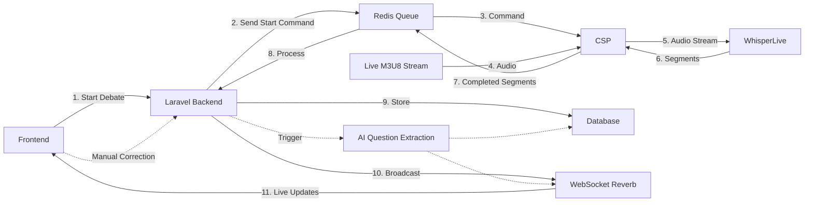

This guide provides a detailed walkthrough of how KDAI transcribes live parliamentary debates from
M3U8 streams to processed transcripts with extracted questions.

## Overview

The transcription process converts live audio streams into searchable text transcripts with
AI-extracted questions. The system uses a streamlined architecture with integrated backend
processing.

## High-Level Flow



**Note**:

- **Numbered solid lines** show the automatic live transcription flow, initiated by the frontend
- **Dashed lines** represent manual/triggered operations (corrections and question extraction)

## Detailed Step-by-Step Process

### 1. Debate Initialization

**Trigger**: User clicks "Start Debate" button in the frontend interface

**Frontend Action**: Sends HTTP POST request to backend

**API Call**: `POST /api/debate`

**Request Payload**:

```json
{
  "title": "Debate Title",
  "m3u8_url": "https://example.com/stream.m3u8",
  "scheduled_start": "2024-01-15T14:00:00Z"
  // ... other debate metadata
}
```

**Backend Actions**:

1. Validate debate data (M3U8 URL, title, scheduled time, etc.)
2. Create debate record in database with unique UUID
3. Clear any existing segment tracking for this debate
4. **Send start capture command to CSP** via Redis queue (`csp_queue`)

**Redis Command Message**:

```json
{
  "command": "start_capture",
  "debate_id": "debate-uuid",
  "hls_url": "https://example.com/stream.m3u8",
  "debate_start_time": 1705329600.0
}
```

**Result**:

- Frontend receives debate record with UUID
- CSP service receives command from Redis and begins monitoring the live M3U8 stream
- Transcription pipeline is activated

### 2. Real-time Audio Streaming (CSP Service)

**Service**: `kdai-atts-csp` (Port 7010)

**Process**:

- Connects to M3U8 stream URL
- Uses FFmpeg to extract and stream audio in real-time
- Converts audio to 16kHz mono float32 format
- Streams audio to WhisperLive via WebSocket

**Technical Details**:

- Audio format: f32le (32-bit float little-endian)
- Sample rate: 16000 Hz
- Channels: 1 (mono)
- Chunk size: 16384 bytes (~4096 samples)

### 3. Real-time Transcription (WhisperLive)

**Service**: `kdai-whisperlive` (Port 9090)

**Technology**: OpenAI Whisper with real-time streaming

**Process**:

- Receives audio stream from CSP via WebSocket
- Performs real-time speech-to-text transcription
- Uses Voice Activity Detection (VAD) for segment detection
- Sends transcription segments back to CSP with the following structure:

**Segment Message Format**:

```json
{
  "segments": [
    {
      "id": "segment-identifier",
      "text": "Transcribed text content",
      "start": 0.0,
      "end": 2.5,
      "completed": true
    }
  ]
}
```

**Key Fields**:

- `text`: The transcribed text content for this segment
- `start`: Start time in seconds from audio stream beginning
- `end`: End time in seconds
- `completed`: Boolean flag indicating if the segment is finalized
- `id` (optional): Unique identifier for the segment

**Segment Refinement**:

WhisperLive may send multiple versions of the same segment (identified by `start` time) with
progressively refined text. The CSP's SegmentBuffer detects these refinements and handles them
appropriately, either updating pending segments (pre-send corrections) or sending correction updates
(post-send corrections).

**Configuration**:

```bash
WHISPERLIVE_HOST=kdai-whisperlive
WHISPERLIVE_PORT=9090
```

**WhisperLive Connection Setup**:

```json
{
  "uid": "unique-session-id",
  "language": "nl",
  "task": "transcribe",
  "model": "turbo",
  "use_vad": true
}
```

### 4. Segment Buffering (CSP)

**Process**:

CSP uses a simplified buffering approach that relies on WhisperLive's `completed` flag to identify
finished segments:

- Receives transcription segments from WhisperLive with `completed` status
- Tracks segments to detect and handle corrections (both pre-send and post-send)
- Waits a configurable number of segments before sending (default: 1) to allow for corrections
- Merges short sentences (< 15 characters) with following segments for better readability
- Uses fuzzy matching (85% similarity threshold) to detect and skip duplicates
- Tracks segment IDs based on start time from WhisperLive

**Key Features**:

- **Pre-send corrections**: Updates segments that haven't been sent yet when WhisperLive refines
  them
- **Post-send corrections**: Detects when WhisperLive corrects already-sent segments and sends
  updates
- **Duplicate detection**: Uses token_sort_ratio to catch near-duplicates across segments
- **Short sentence merging**: Automatically combines fragments like "IAI." with following text

**Segment Buffer Configuration**:

```python
SegmentBuffer(
    similarity_threshold=0.85,  # Fuzzy matching for duplicates and corrections
    short_sentence_threshold=15,  # Merge sentences shorter than this
    segments_to_wait_for_corrections=1  # Wait 1 segment before sending
)
```

### 5. Backend Processing

**Trigger**: Redis queue message from CSP with completed segment

**Redis Queue Message Format:**

```json
{
  "debate_id": "uuid",
  "segment_id": "00_05_23_456",
  "transcript_content": "Completed transcription segment.",
  "is_realtime": true
}
```

**Queue**: `ts_segment_complete`

**Job**: `ProcessTsSegmentCompleteJob`

**Processing Steps:**

1. **Apply Text Filtering**: Use `TranscriptFilterService` to clean and normalize transcript text
2. **Parse Timestamp**: Convert segment_id (format: `HH_MM_SS_mmm`) to milliseconds offset from
   debate start
3. **Database Storage**: Create or update `Segment` record with:
   - `debate_id`: Debate UUID
   - `segment_id`: Time-based identifier (HH_MM_SS_mmm)
   - `timestamp_ms`: Milliseconds from debate start
   - `original_text`: Filtered transcript content
   - `is_checked`: false (unchecked for real-time segments)
4. **WebSocket Broadcast**: Dispatch `TranscriptAddedEvent` to all connected clients via Laravel
   Reverb

**Note on Question Extraction:**

Question extraction is NOT automatic during live transcription. It happens separately:

- **Manual Trigger**: Users can request question extraction on corrected transcripts
- **Endpoint**: `POST /api/internal/debate/{debateID}/segment/{segmentID}/corrected-transcript`
- **Job**: `ProcessQuestionExtractionJob` (dispatched manually, not automatically)
- **Event**: `DebateQuestionAddedEvent` (only dispatched when questions are extracted)

### 6. Real-time Broadcasting to Frontend

**Event**: `TranscriptAddedEvent`

**WebSocket Server**: Laravel Reverb (Port 8081, proxied via Nginx to port 8001)

**WebSocket Channel**: `transcript.{debate_id}`

**Transcript Event Payload**:

```json
{
  "event": "transcript.added_event",
  "data": {
    "id": "segment-uuid",
    "segment_id": "00_05_23_456",
    "transcript": "Filtered transcribed text...",
    "timestamp_ms": 323456
  }
}
```

**Frontend Handling**:

1. Frontend listens on channel `transcript.{debate_id}` via Laravel Echo
2. On receiving `transcript.added_event`, calls `segmentsCollection.utils.writeUpsert()`
3. TanStack DB reactive query updates automatically
4. Vue component re-renders with new transcript segment

**Frontend Sync Composable** (`useTranscriptSegmentsSync.ts`):

```typescript
channel.listen('.transcript.added_event', data => {
  const segment: Segment = {
    id: data.id,
    segment_id: data.segment_id,
    timestamp_ms: data.timestamp_ms,
    original_text: data.transcript,
    manual_text: data.transcript,
    is_checked: false,
    is_realtime: true,
    display_text: data.transcript,
  };

  segmentsCollection.utils.writeUpsert(segment);
});
```

### 7. Manual Transcript Correction and Question Extraction

**User Action**: Submit correction via frontend

**API Call**: `POST /api/internal/debate/{debateID}/segment/{segmentID}/corrected-transcript`

**Payload**:

```json
{
  "corrected_transcript": "Corrected text..."
}
```

**Backend Actions**:

1. Update segment's `manual_text` field with correction
2. Set `is_checked` to true
3. **Optionally dispatch question extraction job** (if configured)
4. Broadcast `transcript.updated_event` via WebSocket to all clients

**Question Extraction Flow** (Manual):

When question extraction is triggered (either manually or via correction):

1. `ProcessQuestionExtractionJob` is dispatched
2. Job uses LLM to analyze transcript segment(s)
3. Extracts parliamentary questions from text
4. Saves questions to `debate_questions` table
5. Dispatches `DebateQuestionAddedEvent` to channel `questions.{debate_id}`

**Frontend Question Sync** (`useDebateQuestionsSync.ts`):

```typescript
channel.listen('.questions.added_event', data => {
  const question: DebateQuestion = {
    id: data.id,
    text: data.text,
    timestamp_ms: data.timestamp,
    question_number: data.question_number,
    topic: data.topic,
    debate_id: debateId.value,
    // ... other fields
  };

  debateQuestionsCollection.utils.writeUpsert(question);
});
```

### 8. Debate Termination

**Trigger**: User stops the debate

**API Call**: `DELETE /api/debate/{id}`

**Backend Actions**:

- Send stop capture message to CSP via Redis
- CSP closes WhisperLive WebSocket connection
- CSP terminates FFmpeg audio stream
- Update debate status to completed
- Broadcast status change via WebSocket

## Error Handling

### Common Error Scenarios

1. **Stream Unavailable**: CSP detects M3U8 connection issues, reports to backend via Redis
2. **WhisperLive Connection Failure**: CSP retries connection up to 3 times with 5-second fixed
   delay between attempts
3. **Audio Stream Gaps**: CSP monitors for empty reads from FFmpeg:
   - Logs warning after 5 seconds of no data (50 consecutive empty reads at 0.1s intervals)
   - Logs recovery info when stream resumes after gap of 1+ seconds
   - Detects and logs gaps between chunks exceeding 1 second
4. **WebSocket Disconnection**: Connection closed gracefully, logged with message count
5. **Transcription Processing Errors**: CSP catches exceptions, logs errors, and notifies backend
   via Redis queue

### Recovery Mechanisms

- **Automatic Retries**: Max 3 attempts with 5-second fixed delay between retries (not exponential
  backoff)
- **Error Reporting**: Sends error notifications to backend via `notify_ts_complete()` with error
  details
- **Health Monitoring**: Continuous audio stream health checks:
  - Monitors consecutive empty reads from FFmpeg stdout
  - Tracks time gaps between audio chunks
  - Logs streaming statistics every 50 chunks
- **Graceful Degradation**: Non-critical failures (e.g., short audio gaps) don't halt transcription
- **Comprehensive Logging**: Structured debug, info, warning, and error logs at all stages

## Performance Considerations

### Throughput Optimization

- Segment buffering provides deduplication and refinement handling
- WhisperLive uses CUDA when available
- Fuzzy deduplication prevents duplicate transcript segments
- WebSocket streaming for frontend updates

### Resource Management

- Database indexing optimized for transcript retrieval
- Whisper model loaded once in WhisperLive container
- WebSocket connection pooling

### Scaling

- **Multiple CSP Instances**: Each CSP handles one concurrent debate stream
- **WhisperLive Scaling**: Deploy multiple WhisperLive instances with client-side load balancing
- **Backend Scaling**: Stateless Laravel services scale horizontally behind load balancer
- **Database Connection Pooling**: PostgreSQL connection pooling for concurrent requests
- **Redis Cluster**: Redis can be clustered for high-availability command distribution
- **WebSocket Scaling**: Laravel Reverb supports horizontal scaling with Redis adapter

Caching: Frequently accessed transcripts cached in Redis with 1 hour TTL

## Monitoring

### Key Metrics

- Streaming health: Audio chunk delivery rate and gaps
- Sentence completion rate: Buffered vs. sent segments
- Redis queue depth: Pending segments in `ts_segment_complete` queue
- WebSocket health: Frontend connection status to Laravel Reverb
- Transcription accuracy: Confidence scores and correction frequency

### Health Checks

- CSP: M3U8 stream connectivity and FFmpeg status
- WhisperLive: Model availability and GPU status
- Redis queues: Queue depth and processing rate
- Backend: Database, Redis, and AI services availability

## Troubleshooting

### Common Issues

1. **No Transcripts**: Check CSP logs, M3U8 URL, WhisperLive connectivity
2. **Poor Quality**: Verify audio source, WhisperLive config, network bandwidth
3. **High Latency**: Monitor audio stream gaps, check GPU availability, WebSocket health
4. **Missing Segments**: Check segment buffer configuration, verify WhisperLive completion status

### Debug Commands

```bash
# Service logs
docker compose logs -f kdai-atts-csp
docker compose logs -f kdai-whisperlive

# Check Redis queues
docker exec kdai-redis redis-cli llen ts_segment_complete
docker exec kdai-redis redis-cli llen csp_queue

# Monitor transcript queue processing
docker compose logs -f kdai-backend | grep "ts_segment_complete"

# Monitor real-time transcription
docker compose logs -f kdai-atts-csp | grep "Segment -"

# Backend logs
docker compose logs -f kdai-backend
```

## Technology Summary

The transcription flow uses a streaming architecture:

- **Live Transcription Pipeline**: M3U8 → FFmpeg (CSP) → WhisperLive → CSP → Redis → Backend →
  Frontend
- **Segment Buffering**: CSP's SegmentBuffer tracks segments, detects refinements, and handles
  duplicates
- **Correction Handling**: Supports both pre-send corrections (updates pending segments) and
  post-send corrections (sends updates)
- **Manual Question Extraction**: Triggered separately via correction endpoint or manual request
- **WebSocket Broadcasting**: Real-time updates to frontend via Laravel Reverb
- **Error Handling**: Retry logic with fixed delays, comprehensive logging, and health monitoring

The system supports horizontal scaling and includes monitoring capabilities for production use.
